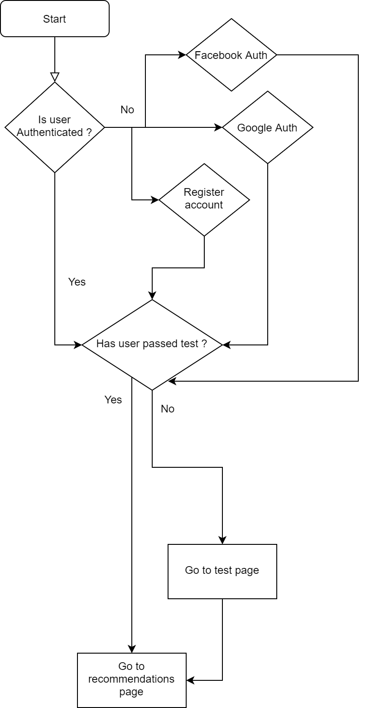

<p align="center">
   <br /><br />
  <span>Feelm is a project where you can discover new movies based on your taste, create lists and share them with your friends. Providing your date of birth and some quick answers we create a personalized profile to recommend movies based on your style.</span>
</p>

<p align="center">
 </br>
    <br>
  <a href="https://play.google.com/store/apps/details?id=gr.esentis.feelm"></a>
</p>

---

## Documentation

If you wish to run the project locally you first have to get API keys for [OMDB](http://www.omdbapi.com/) and [TMDB](https://developers.themoviedb.org/3). Create a .env file inside project and add below fields:

```text
OMDB_KEY=key_for_omdb
TMDB_KEY=key_for_tmdb
```

Then you are ready to run the project.

Supports oAuth2 with **Facebook** and **Google** .

### Startup flow chart



### Recommendation algorithm

The algorithm takes into consideration user's birthdate and his/her zodiac sign. Each zodiac sign is mapped with some movie keywords according to sign's traits ([source 1](https://www.thelisttv.com/the-list/the-perfect-movie-genre-for-each-sign-of-the-zodiac-1-8-21/), [source 2](https://www.californiapsychics.com/blog/astrology-numerology/zodiac-signs-favorite-movie-genre.html), [source 3](https://askastrology.com/movie-genre-based-on-zodiac-sign/) and [source 4](https://www.quora.com/What-5-movies-best-describe-your-taste-in-film)).

Moreover, to differentiate same sign's recommendations (p.ex if Virgo has Horror as a mapped keyword **EVERY** person who is Virgo will have horror recommendations, which is not really what we want) after initial registration, users will be prompted to a test page where they will swipe right (**like**) or left (**dislike**) through 15 random recommended movies. After finishing the test, algorithm checks all the movies that the user has disliked to exclude keywords from recommendations and of course all liked movies to append new keywords to recommendations. ***A keyword is excluded if it appears more times on disliked list rather than on liked list.***
